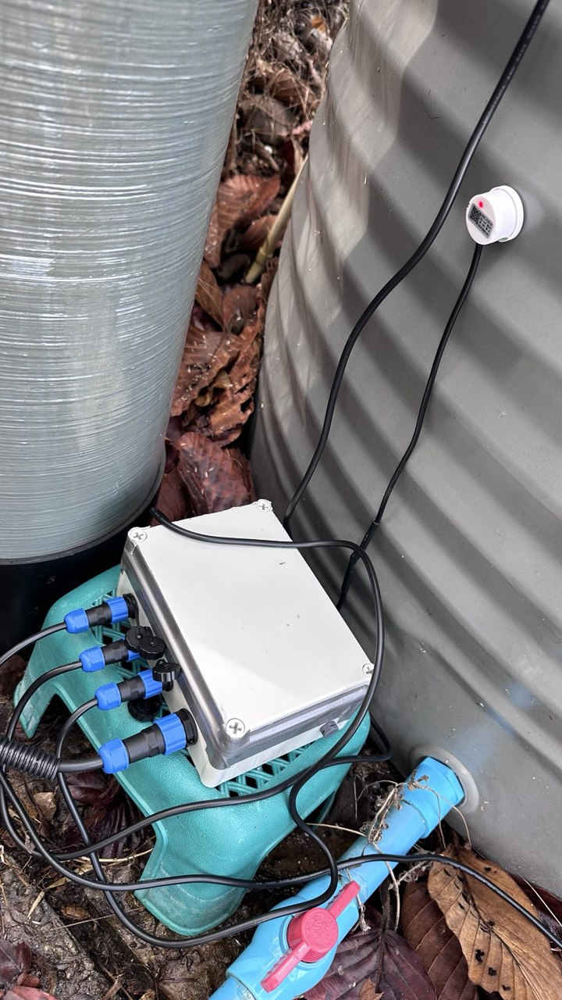
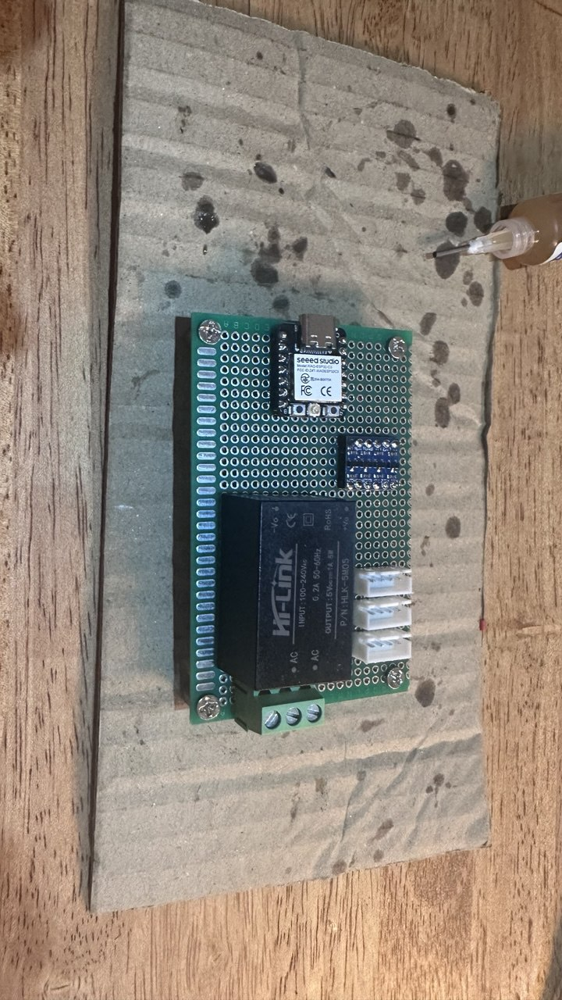

# ESP32 Tank Level Monitoring with XKC-Y25-V & Home Assistant

[](https://esphome.io/)
[](https://www.home-assistant.io/)
[](.)

**This project provides a robust, DIY solution for monitoring liquid levels in a tank using non-contact sensors and seamless integration with Home Assistant.**


_The finished system mounted on a tank, with sensors attached._

## Overview

This system continuously monitors liquid presence at three key points in a tank (e.g., low, high, and an overall check point) using XKC-Y25-V non-contact capacitive sensors. An ESP32 (specifically, a Seeed Studio XIAO ESP32C3) running ESPHome reads the sensor states and reports them wirelessly to Home Assistant for real-time monitoring, logging, and automation triggers. The entire setup is housed in a waterproof enclosure for durability.

## Key Features

*   **Real-time Monitoring:** Instantly know the state of three crucial tank levels via Home Assistant.
*   **Non-Contact Sensing:** Utilizes XKC-Y25-V sensors that detect liquid through non-metallic tank walls, avoiding direct contact with the contents – ideal for various liquids, including potentially corrosive ones.
*   **Triple-Level Detection:** Configure sensors for minimum, maximum, and intermediate levels, or any three points relevant to your needs.
*   **Reliable Integration:** Uses ESPHome for easy configuration and robust WiFi communication with Home Assistant via its native API.
*   **DIY Friendly:** Built with readily available components.
*   **Durable & Safe:** Housed in an IP67 enclosure with waterproof connectors (IP68) and includes necessary logic level shifting for safe operation between the 5V sensors and the 3.3V ESP32.
*   **AC Powered:** Uses a compact AC-DC converter for a permanent installation.

## How It Works Visually

```mermaid
graph LR
    subgraph Enclosure [Enclosure (IP67)]
        direction TB
        AC[Mains AC Power] --> HLK[HLK-5M05 Power Supply (5V DC)]
        HLK --> ESP32[XIAO ESP32C3 VIN]
        HLK --> LLS_HV_PWR[Logic Level Shifter HV (5V)]
        ESP32_3V3[ESP32 3.3V Out] --> LLS_LV_PWR[LLS LV (3.3V)]
        GND_COMMON[Common GND] --> LLS_GND[LLS GND]
        GND_COMMON --> ESP32_GND[ESP32 GND]
        HLK -- GND --> GND_COMMON

        S1_SIG_IN[Sensor 1 Signal In (5V)] --> LLS_HV1[LLS HV1]
        LLS_LV1[LLS LV1] -- 3.3V Signal --> ESP32_GPIO9[ESP32 GPIO9]

        S2_SIG_IN[Sensor 2 Signal In (5V)] --> LLS_HV2[LLS HV2]
        LLS_LV2[LLS LV2] -- 3.3V Signal --> ESP32_GPIO10[ESP32 GPIO10]

        S3_SIG_IN[Sensor 3 Signal In (5V)] --> LLS_HV3[LLS HV3]
        LLS_LV3[LLS LV3] -- 3.3V Signal --> ESP32_GPIO8[ESP32 GPIO8]

        ESP32 -- WiFi --> Router[WiFi Router]
    end

    subgraph Outside [Outside Enclosure]
        direction TB
        Sensor1[XKC-Y25-V Sensor 1] -- Brown(+5V), Blue(GND), Yellow(Signal) --> S1_CONN[SP13 Connector 1]
        Sensor2[XKC-Y25-V Sensor 2] -- Brown(+5V), Blue(GND), Yellow(Signal) --> S2_CONN[SP13 Connector 2]
        Sensor3[XKC-Y25-V Sensor 3] -- Brown(+5V), Blue(GND), Yellow(Signal) --> S3_CONN[SP13 Connector 3]

        S1_CONN -- 5V Power --> HLK
        S1_CONN -- GND --> GND_COMMON
        S1_CONN -- 5V Signal --> S1_SIG_IN

        S2_CONN -- 5V Power --> HLK
        S2_CONN -- GND --> GND_COMMON
        S2_CONN -- 5V Signal --> S2_SIG_IN

        S3_CONN -- 5V Power --> HLK
        S3_CONN -- GND --> GND_COMMON
        S3_CONN -- 5V Signal --> S3_SIG_IN

        AC_Source[AC Power Source] --> AC_CONN[SP16 Power Connector]
        AC_CONN --> AC
    end

    Router -- Network --> HA[Home Assistant]

    style Enclosure fill:#f9f,stroke:#333,stroke-width:2px
    style Outside fill:#e0e0e0,stroke:#333,stroke-width:1px
```


## Hardware Components

*   **Sensors:** 3x [XKC-Y25-V](https://www.aliexpress.com/item/1005006143971460.html) Non-contact Capacitive Liquid Level Sensors
    *   Detects liquid through non-metallic walls.
    *   Operates at 5V, outputs a 5V digital signal.
    *   *Connections Used:* Brown (+5V), Blue (GND), Yellow (Signal Output). Black wire is unused.
    *   *Manual:* [XKC-Y25-V-manual.pdf](./XKC-Y25-V-manual.pdf)
*   **Microcontroller:** 1x [Seeed Studio XIAO ESP32C3](https://www.seeedstudio.com/Seeed-XIAO-ESP32C3-p-5431.html)
    *   Compact ESP32 board running ESPHome.
    *   Reads sensor data (via level shifter) and communicates with Home Assistant.
    *   Uses GPIO9, GPIO10, GPIO8 for sensor inputs.
*   **Level Shifter:** 1x [4-Channel IIC I2C Logic Level Shifter Bi-Directional Module](https://www.aliexpress.com/item/1005006968679749.html) (or similar)
    *   Safely converts the 5V sensor signals to 3.3V for the ESP32.
    *   Connect HV to 5V, LV to ESP32's 3.3V output, GND to common ground.
    *   Sensor Yellow Wires -> HV1, HV2, HV3 inputs.
    *   ESP32 GPIO Pins -> LV1, LV2, LV3 outputs.
*   **Power Supply:** 1x [Hi-Link HLK-5M05 AC-DC Module (5V, 1A)](https://www.aliexpress.com/item/1005003052023770.html)
    *   Converts mains AC to 5V DC to power the ESP32 and sensors.
*   **Connectors:**
    *   3x SP13 IP68 Waterproof Connector (4-pin) - For detachable sensor connections.
    *   1x SP16 IP68 Waterproof Connector (3-pin) - For AC power input.
*   **Enclosure:** 1x Plastic IP67 Rated Enclosure (Size appropriate for components)
*   **Vent:** 1x M12 Nylon Breathable Waterproof Vent Plug (IP68) - Prevents pressure buildup/condensation.
*   **Wires, PCB:** Jumper wires or a custom PCB for connections.


_Internal components wired within the enclosure._

## Wiring & Connections

**(Refer to the textual schematic and component descriptions in the original sections below for detailed pinouts).**

1.  **Power Distribution:**
    *   AC Mains connect via the SP16 connector to the HLK-5M05 input.
    *   HLK-5M05 5V Output connects to:
        *   ESP32 VIN pin.
        *   Level Shifter `HV` pin.
        *   Sensor Brown Wires (+5V) via SP13 connectors.
    *   HLK-5M05 GND Output connects to:
        *   ESP32 GND pin.
        *   Level Shifter `GND` pin.
        *   Sensor Blue Wires (GND) via SP13 connectors.
        *   Ensure all GNDs are common.
    *   ESP32 3.3V Output connects to Level Shifter `LV` pin.
2.  **Sensor Signals:**
    *   Sensor 1 Yellow Wire -> SP13 Pin -> Level Shifter `HV1`. Level Shifter `LV1` -> ESP32 GPIO9.
    *   Sensor 2 Yellow Wire -> SP13 Pin -> Level Shifter `HV2`. Level Shifter `LV2` -> ESP32 GPIO10.
    *   Sensor 3 Yellow Wire -> SP13 Pin -> Level Shifter `HV3`. Level Shifter `LV3` -> ESP32 GPIO8.

## Schematic Diagram (Textual Representation)

Below is a textual schematic showing the interconnections for one sensor. Repeat the Sensor -> Level Shifter -> ESP32 connection for the other two sensors using different shifter channels and GPIO pins.

```text
+5V Supply ───────────────────┬──────────────────────┬──────────→ ESP32 VIN
                              │                      │
                              │ Brown (+5V)          │
                        ┌─────┴────────┐       ┌─────┴─────┐
                        │ XKC-Y25-V    │       │ Level     │
                        │ Sensor       │       │ Shifter   │
                        │              │       │ Module    │
                        │       Yellow ├───────┤ HV (5V)   │
                        │ (Signal Out) │       │ HV1 Input │
                        └─────┬────────┘       ├───────────┤
                              │ Blue (GND)     │ LV1 Output├─→ ESP32 GPIO (e.g., GPIO9)
                              │                │ LV (3.3V) │ ←── ESP32 3.3V Pin
                              │                │ GND       │
Ground ───────────────────────┴────────────────┴───────────┴──→ ESP32 GND Pin
(Common GND)
```

> Note: This diagram shows the signal flow for one sensor. The Tank High Level and Tank Low Level sensors are connected identically using separate channels on the logic level shifter (e.g., HV2/LV2 and HV3/LV3) and connected to their respective ESP32 GPIO pins (GPIO10 and GPIO8).

## Setup & Configuration

### 1. Hardware Assembly

*   Assemble the components according to the wiring diagram. Use a prototyping board or design a PCB for a cleaner setup.
*   Mount the power supply, ESP32, and level shifter inside the IP67 enclosure.
*   Install the waterproof connectors (SP13 for sensors, SP16 for power) and the vent plug on the enclosure walls.
*   Wire the internal components to the enclosure connectors.
*   Connect the XKC-Y25-V sensors to the external side of the SP13 connectors.

### 2. ESPHome Firmware

*   **Install ESPHome:** If you haven't already, install ESPHome (e.g., as a Home Assistant Add-on).
*   **Create Configuration:** Create a new ESPHome device configuration. Use the `esphome.yaml` file provided in this repository as a template.
    *   You **MUST** create a `secrets.yaml` file in your ESPHome directory to store your WiFi credentials (`wifi_ssid` and `wifi_password`). ESPHome will prompt you if it's missing.
    *   Key settings in `esphome.yaml`:
        *   Board: `seeed_xiao_esp32c3`
        *   Framework: `esp-idf`
        *   Binary Sensors defined for GPIO9, GPIO10, GPIO8 with `device_class: moisture`.
*   **Compile & Upload:** Compile the firmware using ESPHome and upload it to the XIAO ESP32C3 (initially via USB, subsequent updates can be Over-The-Air via WiFi).

You can view the complete configuration file here: [esphome.yaml](./esphome.yaml)

### 3. Home Assistant Integration

*   Once the ESP32 connects to your WiFi network, Home Assistant should automatically discover it via the ESPHome integration.
*   Click "Configure" on the discovered device in the Home Assistant Settings -> Devices & Services -> Integrations page.
*   The three binary sensors (e.g., `Tank Level Sensor 1`, `Tank Level Sensor 2`, `Tank Level Sensor 3`) will appear as entities in Home Assistant.
*   You can now add these sensors to your dashboard, use them in automations (e.g., send notifications on low level, turn off a pump on high level), and track their history.

## Installation on Tank

*   Clean the tank surface where the sensors will be placed.
*   Attach the XKC-Y25-V sensors securely to the *outside* of the non-metallic tank wall at the desired monitoring levels. Ensure good contact. Adjust sensitivity if needed (refer to sensor manual).
*   Mount the enclosure securely near the tank.
*   Connect the sensor cables to the enclosure via the SP13 connectors.
*   Connect the main AC power via the SP16 connector.

## Troubleshooting

*   **Sensor Always On/Off:** Check wiring (especially 5V/GND/Signal). Ensure the level shifter is correctly powered (both 5V and 3.3V). Verify sensor sensitivity setting and placement on the tank. Check if the tank material is compatible (non-metallic, within thickness limits).
*   **Device Offline in Home Assistant:** Verify WiFi credentials in `secrets.yaml`. Check WiFi signal strength near the device. Ensure the ESP32 and power supply are receiving power. Check ESPHome logs (via USB or OTA logs if connected).
*   **Incorrect Logic Levels:** Double-check level shifter connections (`HV` to 5V, `LV` to 3.3V, `GND` to common ground, signal paths `HVx` <-> `LVx`).

## Contributing

Found a bug or have an improvement? Feel free to open an Issue or submit a Pull Request!
